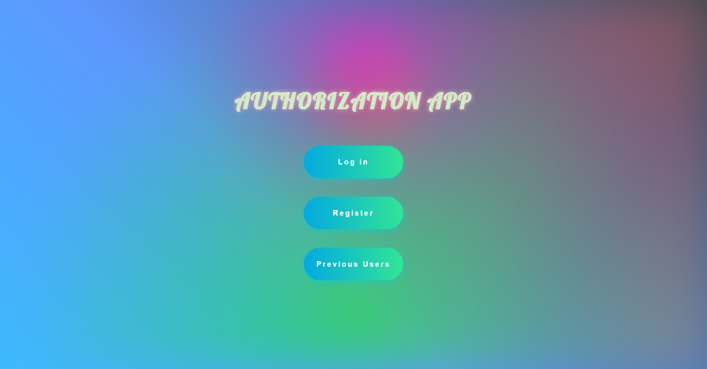
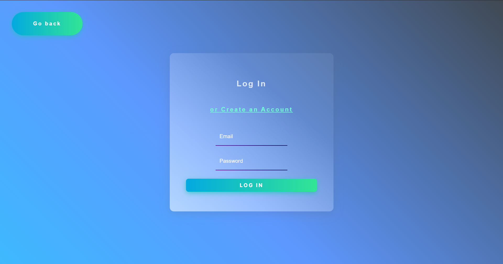
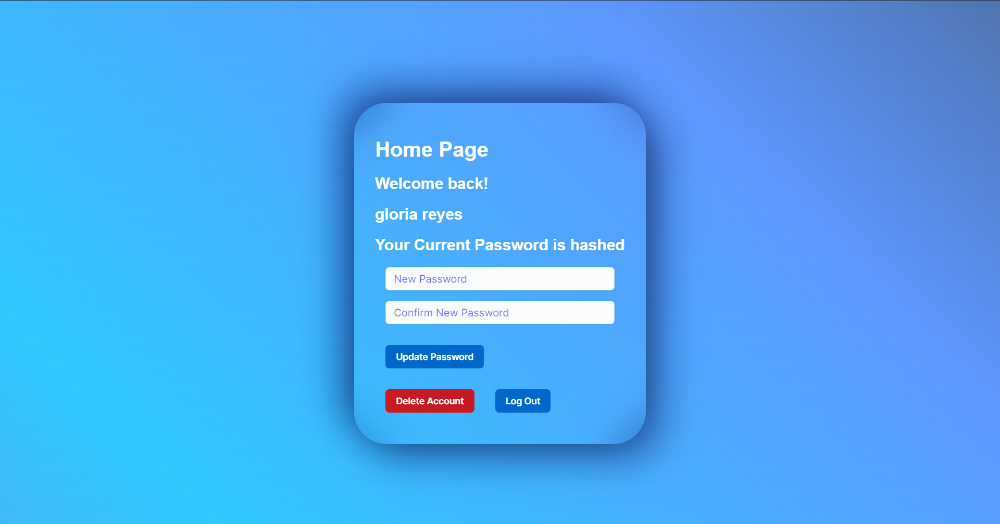

# - 📑 - Log In Form - 💻 -

This is my demo of creating a Back End Server and incorporating it in a Log In form. This is also to show my understanding of
Node.js, Express.js, PostgreSQL, Prisma.io, TypeScript and Next.js. I used Netlify to host my Front End Website and Heroku to host my Back end Server, while AWS will be hosting the PostgreSQL Database. 

### ** Disclaimer ** Please do not enter real emails or passwords, this app is intent for showcasing only

You are able to register a new account, use '@test.com' as the email domain to be sure no real account is being saved. Fill out the form as normal. After the POST request is sent, the Back End Server hashes your password before being saved in the database. 

You are then redirected to the log in page where you can log in. The log in credentials are compared by the use of prisma and bcrypt. Prisma is an easy way to interact with the database using simple syntax. Using bcrypt to securely compare the plain password text and the already hashed password stored in the database.

At succesful log in you can then see your name and the option to update your password and log out of your session.

## Demo

### Front End Deployed Site
https://log-in-form-444.netlify.app

### Github Repo to the Back End Server
https://github.com/CJ484/BE_LogInForm

## Screenshots

## Badges

